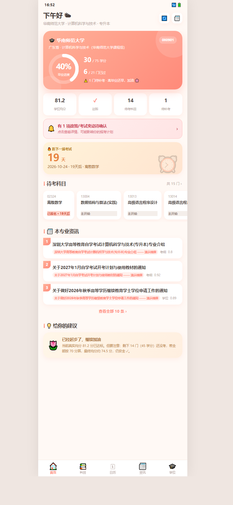
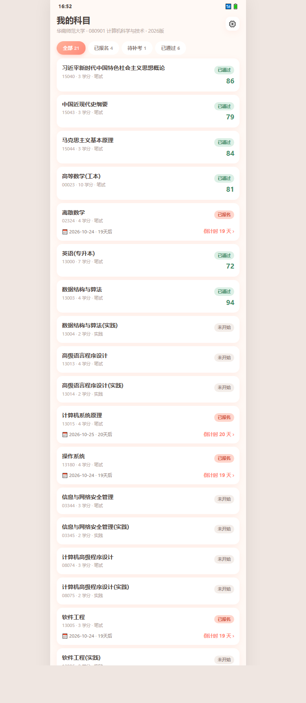
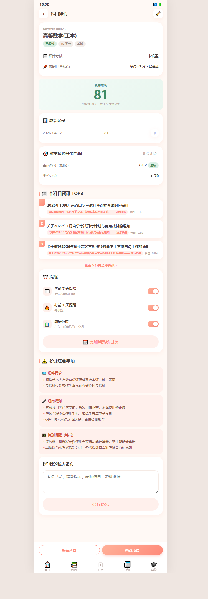
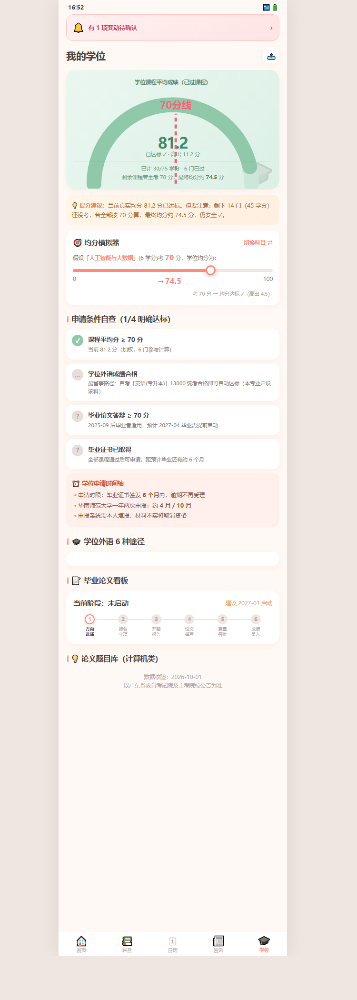
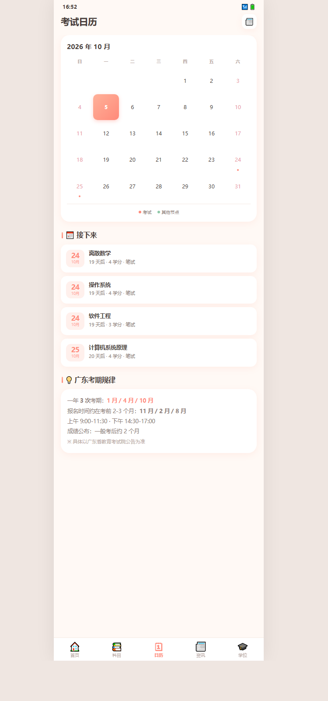
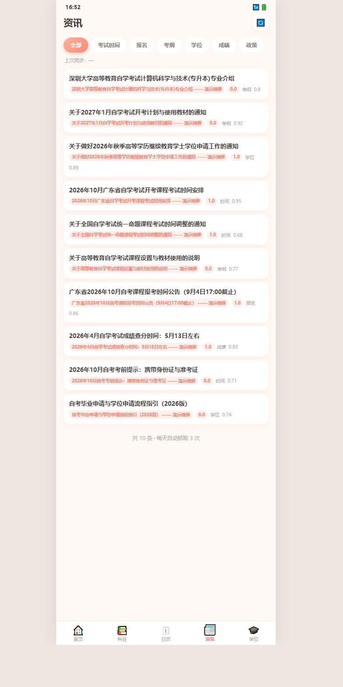

<div align="center">

# 🌸 自考星 · ZikaoStar

**成人自考本科备考管理工具** —— 选专业自动生成考纲、跟踪考试状态与成绩、实时监测政策变动、计算学位均分

[](LICENSE)
[](#-快速开始)
[](https://nodejs.org)
[](#-隐私承诺)
[](#-隐私承诺)
[](https://github.com/zhentong520/zikao-star/releases)

一个**本地优先、零商业化**的自考备考助手。所有数据存在你自己的设备上。

</div>

---

## 📸 界面一览

<div align="center">
<table>
<tr>
<td width="33%"></td>
<td width="33%"></td>
<td width="33%"></td>
</tr>
<tr>
<td align="center"><b>首页总览</b><br><sub>进度环 · 变动预警 · 资讯TOP3</sub></td>
<td align="center"><b>科目列表</b><br><sub>按状态分组 · 进度一目了然</sub></td>
<td align="center"><b>科目详情</b><br><sub>首屏即该科目最相关的3条资讯</sub></td>
</tr>
<tr>
<td></td>
<td></td>
<td></td>
</tr>
<tr>
<td align="center"><b>学位看板</b><br><sub>均分仪表盘 · 提分建议 · 论文题目库</sub></td>
<td align="center"><b>考试日历</b><br><sub>倒计时 · 报名节点</sub></td>
<td align="center"><b>资讯聚合</b><br><sub>本地缓存 · 离线可读</sub></td>
</tr>
</table>
</div>

<p align="center">
  <sub>界面为实际运行截图（数据为演示数据）· 暖甜设计风格 · 移动端优先布局</sub>
</p>

---

## 这个工具解决什么问题

自考最大的痛点不是"考什么"，而是**"信息散落 + 进度失控 + 政策变动踩坑"**：

| 痛点 | 现状 | 这里怎么解 |
|------|------|-----------|
| 考纲到处找 | 省考试院官网、机构站、论坛帖，要跳 5-8 个网页 | 选「省 + 院校 + 专业」自动生成完整考纲 |
| 进度没数 | 不知道自己还剩几门、能不能按时毕业 | 首页环形进度 + 学分进度 + 预计毕业时间 |
| 均分焦虑 | 考完才发现学位要均分 70，前几门 60 多分，学位没了 | 实时均分仪表盘 + **预测均分**（告诉你剩下要考多少才够线） |
| 错过报名 | 报名/考试/出分时间分散，错过一次等半年 | 三级提醒（报名期 / 考前 7 天 / 考前 1 天 / 出分） |
| 政策变动 | 换考纲、调时间，往往考完才知道 | 变动自动检测 + 差异高亮 + 强提醒 |
| 论文迷茫 | 不知道什么时候启动、题目怎么选 | 论文看板 + 15 个计算机方向题目库 |

> **一句话：别人帮你卖课，我们帮你管进度。**

---

## ✨ 核心功能

### 📊 报考总览（首页）

- **环形进度**：已过学分 / 总学分，一眼看清进度
- **双均分显示**：
  - `真实均分` —— 已过课程加权平均（学位申请看这个）
  - `预测均分` —— 假设剩余课程全考 70 分的最终结果（避免虚假安全感）
- **变动预警横幅**：有政策/考试变动时置顶高亮
- **考试倒计时**：距下一场还有多少天
- **本专业资讯 TOP3**

### 📚 科目详情（核心页）

进入科目页，**首屏就是该科目最相关的 3 条资讯**，往下是：

- 考试状态、最近一次考试时间、我的成绩
- **成绩录入**：输入分数实时显示对学位均分的影响
- 提醒设置 + 考试注意事项 + 私人备忘
- 该科目全部相关资讯

### 🔔 政策变动监测（技术亮点）

爬虫自动抓取官方站点，检测到与报考相关的变动时主动推送：

```
广东省教育考试院  →  华师 / 深大继续教育学院  →  地方招考网
         ↓
    分类 + 相关性过滤 + 变动识别（风险分级）
         ↓
    HIGH（考试调整/停考/课程变更）
    MEDIUM（报名截止/成绩公布/学位政策）
    LOW（一般政策解读）
```

**降噪是这类工具的生命线**，所以做了三层过滤：

1. **地域收敛** —— 只保留广东/广州/深圳内容（自考考务各省独立，外省信息对本地考生无价值）
2. **聚合页剔除** —— 「XX专业信息」这类目录导航页直接丢弃
3. **正文提取** —— 用文本密度算法而非"取最长容器"，避免抓到的全是站点导航

### 🎓 学位看板

- 均分仪表盘（70 分线标注）
- **提分建议**：告诉你"剩下几门平均要考多少分才够线"
- **均分模拟器**：拖动滑块看"某科考 X 分 → 最终均分变多少"
- 学位条件自查清单（按院校规则引擎生成）
- 论文题目库

### ⚙️ 两种运行模式

| | 🖥️ PC 端 | 📱 Android 端 |
|---|---|---|
| 爬虫 | Node 守护进程，**可全天常驻** | WebView 内运行，打开 App 时抓一轮 |
| 数据库 | SQLite 文件 | 手机本地存储 |
| 需电脑 | 是 | **否** |
| 适合 | 放家里当信息中枢 + 定时提醒 | 随身带、随手查 |

两端**数据不互通**（各有独立数据库），但**计算逻辑完全一致**（共用 `shared/rules.js`）。

---

## 🚀 快速开始

### 方式一：PC 端（30 秒）

```bash
# 1. 需要 Node.js 22 或更高版本
node -v

# 2. 克隆并初始化
git clone https://github.com/zhentong520/zikao-star.git
cd zikao-star
npm run seed          # 生成含考纲的数据库

# 3. 启动
npm start             # 或 Windows 下双击 启动.bat
```

打开 `http://localhost:5173` 即可使用。

### 方式二：Android APK

下载 [Releases](https://github.com/zhentong520/zikao-star/releases) 里的 APK，传到手机安装。

首次安装会提示「允许安装未知来源应用」——自签名包，点允许即可。

> ⚠️ 首次打开需联网抓取，等待 10-30 秒属正常。

### 方式三：iOS（PWA）

苹果要求 iOS App 必须用 macOS + Xcode 签名，**无法在 Windows 上打包**。

最省事的做法：电脑跑 `npm start`，iPhone 用 Safari 打开 `http://<电脑IP>:5173` → 分享 → **添加到主屏幕**。日常体验与原生 App 几乎无异。

---

## 📁 项目结构

```
zikao-star/
├── shared/                 ← PC 与手机共用（关键！）
│   ├── rules.js            #   分类/过滤/变动检测/HTML解析（纯JS无依赖）
│   ├── store.js            #   localStorage + IndexedDB 数据层
│   └── crawler-web.js      #   浏览器版爬虫
│
├── server/                 ← PC 端（Node）
│   ├── index.js            #   HTTP 服务 + API + 计算核心
│   ├── schema.sql          #   SQLite 表结构
│   ├── seed.js             #   考纲种子数据
│   ├── crawler/index.js    #   Node 爬虫
│   ├── daemon.js           #   守护进程（自适应提频）
│   └── crawl-once.js       #   单次抓取
│
├── web/                    ← 前端（PWA，双模式）
│   └── index.html          #   单文件 UI + 业务逻辑
│
├── data-sample/            ← 开源示例数据库（不含隐私）
├── docs/                   ← 产品文档与 APK 说明
└── prototype/              #   高保真原型
```

**为什么要有 `shared/`**：
PC 端用 Node，手机端用 WebView，两边必须跑**同一套规则**，否则「电脑上抓到的」和「手机上抓到的」结果不一样，用户会怀疑数据可信度。所以分类、过滤、变动检测这些核心逻辑抽成一份纯 JS，两端共用。

---

## 🔧 技术栈

| 层 | 选型 | 说明 |
|----|------|------|
| 后端 | Node.js 原生 `http` | 零框架依赖 |
| 数据库 | `node:sqlite` | Node 22 内置，**无需编译原生模块** |
| 爬虫 | 自研零依赖引擎 | 原生 `fetch` + 自写 HTML 解析 |
| 前端 | 原生 JS 单文件 | 无框架，构建产物即源码 |
| 移动端 | Capacitor 6 | 壳成 APK |
| 存储（移动） | localStorage + IndexedDB | 零原生插件，打包不会失败 |

**设计取向**：能不用依赖就不用。整个项目除了 Capacitor（仅打包需要）没有第三方运行时依赖，`git clone` 完 `npm start` 就能跑。

---

## 📄 数据来源与免责声明

### 考纲数据

来源于**公开官方渠道**整理：

- 广东省教育考试院
- 华南师范大学继续教育学院 / 教育科学学院
- 深圳大学继续教育学院

已在 `data-sample/zikao.db` 的 `major_group.verified_at` 字段标注核验时间。

### 资讯抓取

爬虫仅抓取上述站点的**公开页面**，遵守 robots.txt、限速、不存储个人信息、不二次分发原文全文。每条资讯均标注来源与原文链接，并提供「阅读原文」跳转。

### ⚠️ 重要提示

- 本工具提供的所有信息 **仅供参考，不构成官方承诺**
- **政策以广东省教育考试院及各主考院校官方公告为准**
- 学位授予条件由各校自主制定，**本文档中的规则来自公开信息整理，具体以你所在院校的最新细则为准**
- 请**不要**将本工具当作「包过」「保学位」的依据
- 涉及报名、缴费等操作请通过官方渠道

若发现数据有误，欢迎提 Issue 指出（附上官方来源链接），会尽快修正。

---

## 🔒 隐私承诺

- ✅ **无广告**
- ✅ **无用户追踪 / 无第三方 SDK**
- ✅ **无账号体系**（不需要注册登录）
- ✅ **所有数据本地存储**，不上传任何服务器
- ✅ 爬虫只请求公开网页，不发送任何个人信息

唯一的网络请求就是抓取公开的政策公告页面。

---

## 🛠 常用命令

```bash
npm start              # 启动服务
npm run seed           # 重建考纲数据库
npm run crawl          # 抓一次最新资讯
npm run daemon         # 守护进程（自适应提频抓取）
npm run icons          # 重新生成图标
npm run cap:sync       # 同步资源到 Android 工程
npm run cap:android    # 用 Android Studio 打开

# 重新生成开源示例数据库
node server/make-open-repo-db.js
```

### 守护进程的抓取频率

| 时段 | 频率 |
|------|------|
| 普通时期 | 60-180 分钟 |
| 报名期（2/3/8/9/11/12月） | 加密到 30-90 分钟 |
| 考前 30 天 | **10-40 分钟** |
| 每第 10 轮 | 强制全量重爬 |

---

## 🐛 已知限制

- **考纲不是全自动爬取**。官网考纲多为 PDF/表格，自动解析极易出错，因此采用「人工整理入库 + 爬虫只做变动检测」的双轨策略。目前覆盖广东计算机类 080901，其他专业需自行补充 `server/seed.js`。
- **iOS 需 Mac**。苹果平台限制，无法在 Windows 上构建。
- **两端数据不互通**，需手动导出/导入 JSON 同步。
- **资讯正文提取**对极端复杂的政务站排版可能不完美，此时请用「阅读原文」跳转。
- 部分院校站点会变更域名（如华师继续教育学院站点已迁移），失效源可在 `server/seed.js` 的 `source` 表中更新。

---

## 🤝 贡献

欢迎贡献，尤其这几类：

- **补充专业考纲** —— 打开省份更多专业，这是最有价值的贡献
- **新增院校数据源** —— 尤其是其他省份的主考院校官网
- **改进爬虫精度** —— 发现误报/漏报请提 Issue
- **UI 优化** —— 移动端体验、字号、无障碍

提交代码前请确保：

```bash
# 不要提交个人数据
git status  # 确认 data/ 未被 add（已在 .gitignore 中）
```

---

## 📄 许可证

[MIT License](LICENSE)

---

## ⚠️ 免责声明

本项目为个人开发的开源学习工具，与任何教育机构、考试院、院校无任何关联。

使用者需自行核实信息的准确性与时效性。因依赖本项目信息导致的任何后果，作者不承担责任。

---

<div align="center">

**🌸 愿每一位自考生，都能顺利毕业、拿到学位 🌸**

Made with ☕ in Guangzhou

</div>
